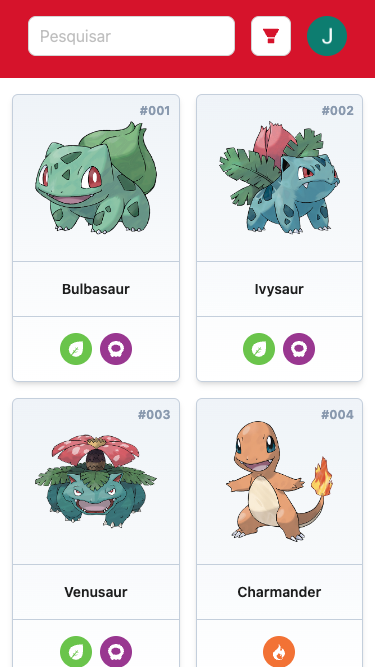
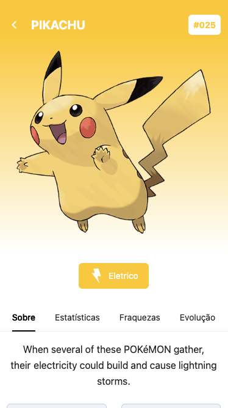

Aqui está a versão atualizada do README com os detalhes adicionais sobre testes,
autenticação, e removendo a seção de contribuição e licença. Também incluí
seções para capturas de tela e organizei melhor as informações.

---

# Pokedex

Pokedex é uma aplicação web interativa que permite a visualização de uma lista
de Pokémons com informações detalhadas de cada um. Este projeto foi desenvolvido
com o objetivo de testar ferramentas e novos conhecimentos em React e seu
ecossistema. Utilizando tecnologias modernas como Vite, React Query, Tailwind
CSS e Ant Design, o projeto busca ser uma referência de boas práticas no
desenvolvimento de aplicações frontend.

## 🎯 Objetivo

O principal objetivo deste projeto é construir uma aplicação Pokedex simples,
porém escalável, enquanto explora ferramentas para gerenciamento de dados,
estilização, análise de qualidade de código e controle de versão de interfaces.
Além disso, a aplicação utiliza ferramentas de automação de análise de código e
integração contínua para garantir qualidade e consistência no desenvolvimento.

## 🛠️ Tecnologias e Ferramentas Utilizadas

### Frontend

- **[Vite](https://vitejs.dev/)**: Uma ferramenta de build extremamente rápida
  para aplicações frontend modernas, que fornece uma excelente experiência de
  desenvolvimento.
- **[React](https://reactjs.org/)**: Biblioteca JavaScript para construção de
  interfaces de usuário.
- **[React Query](https://react-query.tanstack.com/)**: Gerenciamento de estado
  assíncrono eficiente para manipulação de dados vindos de APIs.
- **[Tailwind CSS](https://tailwindcss.com/)**: Framework utilitário de CSS para
  estilização rápida e responsiva.
- **[Ant Design](https://ant.design/)**: Uma das mais populares bibliotecas de
  componentes React, fornecendo componentes prontos e altamente customizáveis
  para UI.

### Autenticação

- **[Auth0](https://auth0.com/)**: Serviço de autenticação utilizado para
  gerenciar o login dos usuários de forma segura e escalável, permitindo
  integração com múltiplas plataformas.

### Testes e Qualidade de Código

- **[Vitest](https://vitest.dev/)**: Framework de testes unitários baseado em
  Vite, extremamente rápido e integrado com o ecossistema do projeto.

  - A aplicação também conta com a **UI do Vitest**, que permite visualizar
    facilmente o status dos testes.
  - Para rodar os testes localmente e visualizar a UI, execute:
    ```bash
    npm run test:ui
    ```
    Isso abrirá a interface do Vitest no navegador, mostrando quais testes estão
    passando e quais falharam.

- **[SonarCloud](https://sonarcloud.io/)**: Serviço de análise de código
  contínua que detecta bugs, vulnerabilidades e outros problemas de qualidade.
- **[DeepSource](https://deepsource.io/)**: Ferramenta que realiza análises
  estáticas de código, detectando possíveis problemas e sugestões de melhorias.
- **[Chromatic](https://www.chromatic.com/)**: Ferramenta de automação de
  interface visual para controle de versões de componentes UI com o Storybook.
- **[Storybook](https://storybook.js.org/)**: Ferramenta para desenvolvimento e
  documentação de componentes de interface de maneira isolada.

### Deploy e Hospedagem

- **[GitHub Pages](https://pages.github.com/)**: Utilizado para hospedar a
  documentação e os componentes do Storybook do projeto.
- **[Vercel](https://vercel.com/)**: Plataforma de hospedagem moderna focada em
  front-end, utilizada para o deploy da aplicação.

## 🚀 Funcionalidades

- Listagem de Pokémons com paginação e carregamento assíncrono.
- Detalhes de cada Pokémon, como habilidades, tipos e estatísticas.
- Autenticação de usuários com **Auth0** para login seguro.
- Interface responsiva e acessível com componentes reutilizáveis do Ant Design.
- Sistema de busca para encontrar Pokémons específicos.
- Integração com API pública para obtenção de dados em tempo real.

## 🎨 Interface de Componentes

A documentação dos componentes do projeto foi feita utilizando **Storybook**,
permitindo o desenvolvimento e teste dos componentes de forma isolada.

- Acesse o Storybook:
  [Pokedex Storybook](https://joaojuniorbr.github.io/pokedex-storybook)

## 🌍 Deploy da Aplicação

A aplicação está hospedada na Vercel e pode ser acessada diretamente no seguinte
link:

- [Pokedex na Vercel](https://pokedex-joaojunior.vercel.app/)

## 📊 Análise de Código e Integração Contínua

Para garantir a qualidade do código, estão configuradas ferramentas de análise
estática e testes automatizados. Isso inclui detecção de bugs, análise de
vulnerabilidades e sugestão de melhorias no código.

### SonarCloud

O **SonarCloud** realiza análises contínuas para identificar possíveis problemas
de qualidade no código. Ele verifica a base de código com foco em bugs, code
smells, cobertura de testes e segurança.

- Acesse a análise do SonarCloud:
  [SonarCloud Dashboard](https://sonarcloud.io/project/overview?id=joaojuniorbr_pokedex)

### DeepSource

O **DeepSource** é outra ferramenta de análise de código estática, que
complementa o SonarCloud. Ele fornece insights sobre a qualidade do código,
detecta erros potenciais e sugere melhorias.

- Acesse a análise do DeepSource:
  [DeepSource Dashboard](https://deepsource.io/gh/joaojuniorbr/pokedex/)

## 🔧 Como Executar o Projeto Localmente

Para executar este projeto localmente, siga as etapas abaixo:

1. Clone o repositório:

   ```bash
   git clone https://github.com/joaojuniorbr/pokedex.git
   ```

2. Navegue até o diretório do projeto:

   ```bash
   cd pokedex
   ```

3. Instale as dependências:

   ```bash
   npm install
   ```

4. Inicie o servidor de desenvolvimento:

   ```bash
   npm run dev
   ```

5. Acesse a aplicação no navegador:

   ```
   http://localhost:5173
   ```

## 🧪 Testes e Desenvolvimento de Componentes

O projeto utiliza o **Storybook** para desenvolvimento isolado de componentes.
Para iniciar o Storybook localmente, utilize:

```bash
npm run storybook
```

Isso abrirá a interface do Storybook no seu navegador, permitindo a visualização
e interação com os componentes.

Para rodar os testes com a **UI do Vitest**, utilize:

```bash
npm run coverage
```

Isso abrirá a interface de testes do Vitest no navegador, permitindo ver o
status dos testes unitários.

## 📸 Capturas de Tela

### Tela Inicial



### Detalhes de um Pokémon



### Login com Auth0


